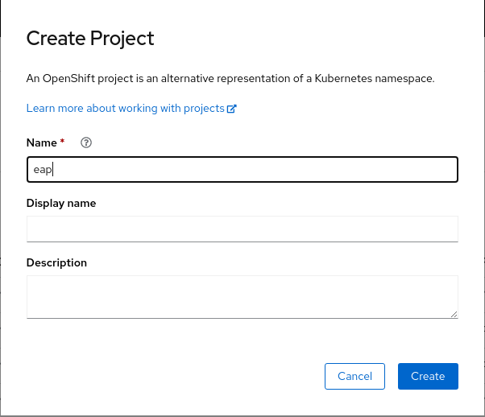
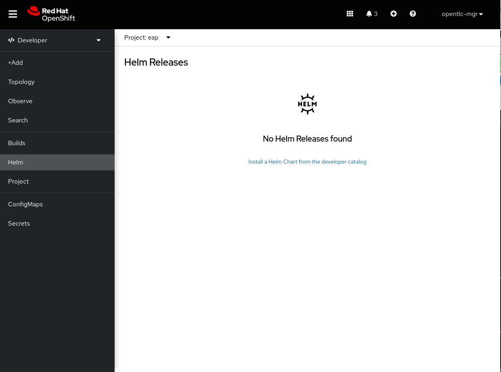
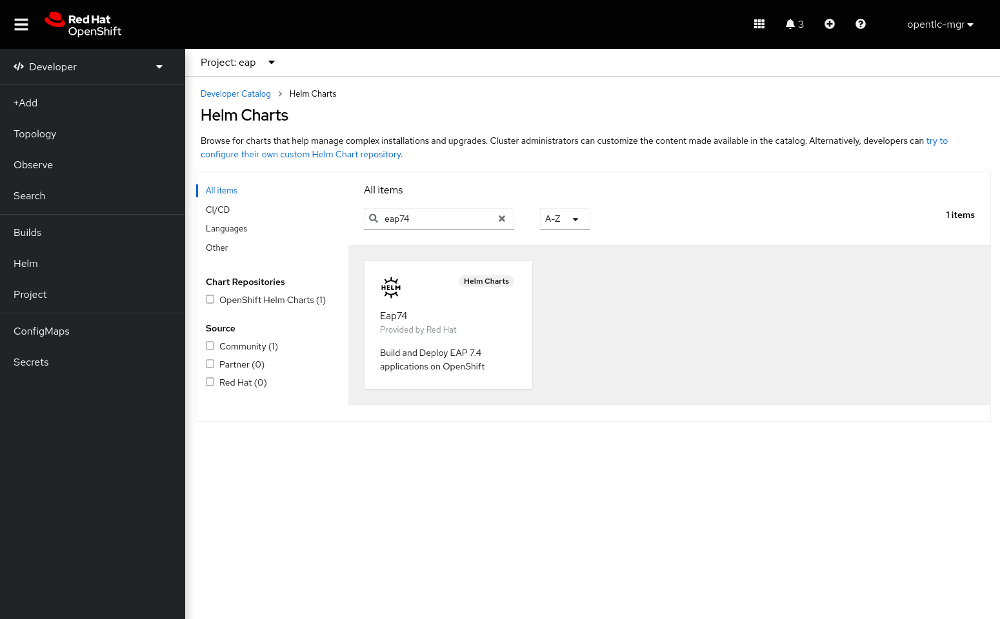
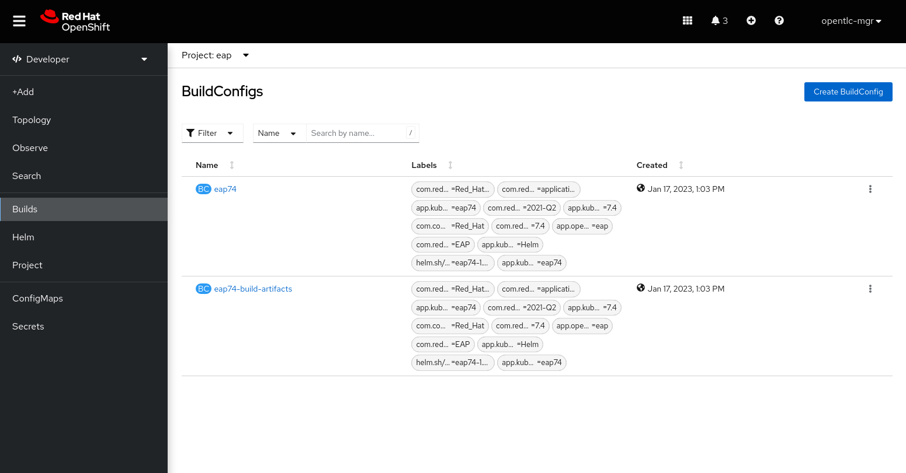
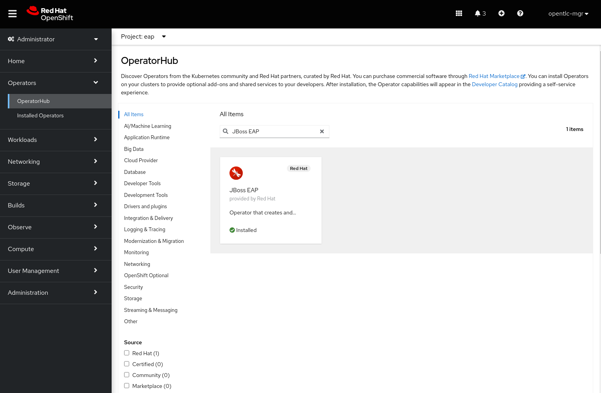
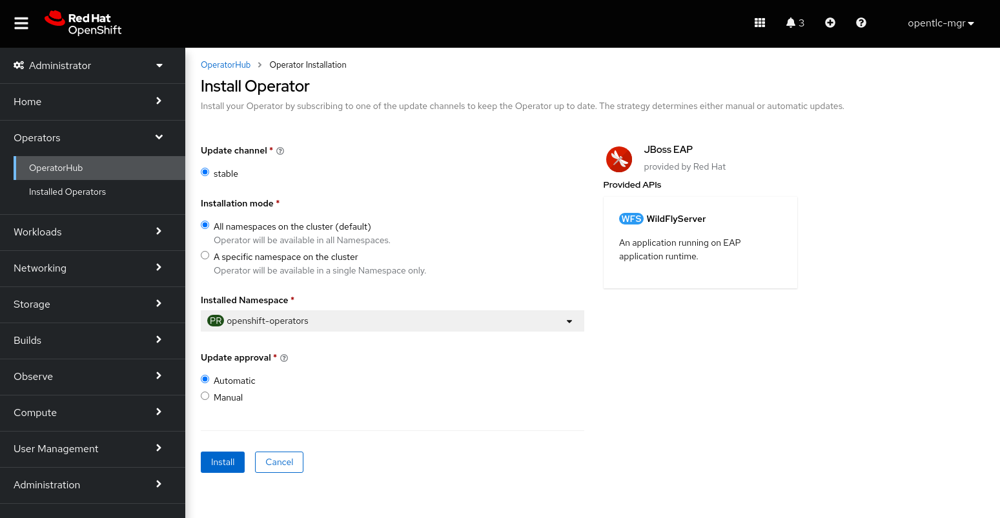
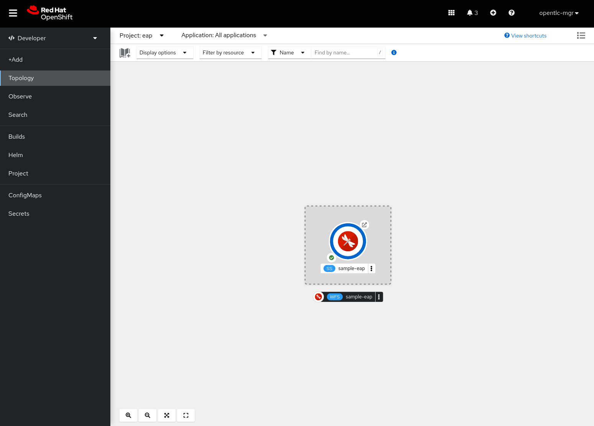

# Red Hat JBoss EAP on Azure Red Hat OpenShift Hello World

This is a simple application that demonstrates a basic deployment of an application Azure Red Hat OpenShift.


## Steps to deploy EAP app to Azure Red Hat OpenShift

From the Developer UI, create a new OpenShift project e.g "eap". 

Click on "Project" and then click on "create a Project".  



Click on "Create" and then go to "Helm" and click on "Install a Helm Chart from the developer catalog"



Enter "eap74" in the filter field.



Select "Eap74" and click on "Install Helm Chart"

In the "YAML view", paste the following yaml:

```
image:
  tag: latest
build:
  enabled: true
  mode: s2i
  uri: 'https://github.com/jamesfalkner/helloworld-eap.git'
  ref: main
  output:
    kind: ImageStreamTag
  env:
    - name: MAVEN_ARGS_APPEND
      value: '-Dcom.redhat.xpaas.repo.jbossorg'
  triggers: {}
  s2i:
    version: latest
    arch: amd64
    jdk: '11'
    amd64:
      jdk8:
        builderImage: registry.redhat.io/jboss-eap-7/eap74-openjdk8-openshift-rhel7
        runtimeImage: registry.redhat.io/jboss-eap-7/eap74-openjdk8-runtime-openshift-rhel7
      jdk11:
        builderImage: registry.redhat.io/jboss-eap-7/eap74-openjdk11-openshift-rhel8
        runtimeImage: registry.redhat.io/jboss-eap-7/eap74-openjdk11-runtime-openshift-rhel8
deploy:
  enabled: false
```

Click on "Install" to install the Helm chart.

Goto "Builds", you should see the following.



These builds will take a few minutes to complete. Once they are done, we're going to deploy our JBoss EAP application using the EAP Operator.

Switch back to the Administrator UI, and goto "Operators" and "Operator Hub".  Enter "JBoss EAP" in the filter field.



Select "JBoss EAP" and click on "Install"




From the "Install Operator" page, click on "Install" to install the JBoss EAP operator.

Once the JBoss EAP operator is installed, switch back to the Developer UI.

From the Developer UI. Ensure you're using the same project you installed the Helm chart in to create the EAP builds.

Click on "+Add" and select "Operator Backed".

From the list of options, select "WildflyServer", and then click on "Create"

Paste the following into the "YAML View".

```
apiVersion: wildfly.org/v1alpha1
kind: WildFlyServer
metadata:
  name: sample-eap
spec:
  applicationImage: 'eap74:latest'
  replicas: 1

```

Click on "Create" to deploy the EAP application.

Once the JBoss EAP application is successfully deployed on Azure Red Hat OpenShift, you will see the following in the "Topology" view.




Click on the "Open Url" icon  , to view the application UI

The application is now successfully deployed to Azure Red Hat OpenShift.
